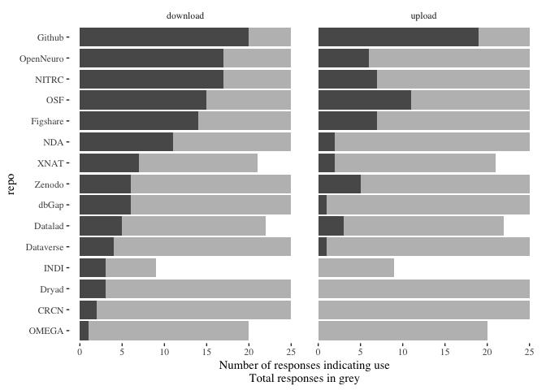
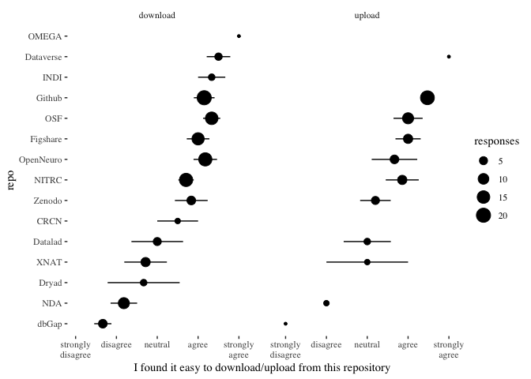

Summary of short data repository survey
================

Our [group](http://cmn.nimh.nih.gov/dsst) is interested in making data
more easily accessible for secondary use. On the morning of June 11th,
immediately following the [2019 OHBM
Hackathon](https://ohbm.github.io/hackathon2019/), we posted a short
survey asking people about the use of data repositories used in
neuroscience. We promoted the survey on twitter, and received 25
responses over the next few days. Though the methodology of our approach
leaves much to be desired, we still think the data we collected is
interesting, and points at some pressing questions for the use of data
repositories in neuroscience and across the sciences generally.

Ultimately, we asked about 15 different repositories. We started with
[this
listing](https://dataverse.org/blog/comparative-review-various-data-repositories)
from Dataverse and added a handful of others without a great deal of
thought. Apologies to those that were left out. Based on feedback in the
free-text box and on twitter, four of these (
[Datalad](http://datasets.datalad.org),
[INDI](http://fcon_1000.projects.nitrc.org),
[OMEGA](https://www.mcgill.ca/bic/resources/omega), and [Xnat
Central](https://central.xnat.org/)) were added after the survey went
live, and so received fewer responses. Others were suggested later, but
we didn’t add them as we were concerned they would receive even fewer
responses. The free text field also contained references to F100 AWS
buckets, ConnectomeDB, AWS Public Datasets, OpenfMRI, LORIS, Neurosynth,
Allen Brain Institute, Neurovault, HCP/BALSA, and LONI. This list made
us realize that the definition of “repository” can be very broad. For
instance, Neurosynth certainly contains data, but it isn’t a place where
independent researchers go to upload their fresh datasets, which is more
akin to what we were thinking of when we created the survey.

Here are all the repos we asked about:

[Collaborative Research in Comp. Neuroscience](https://crcns.org)

[Datalad](http://datasets.datalad.org)

[Dataverse](https://dataverse.org/)

[dbGap](https://www.ncbi.nlm.nih.gov/gap/)

[Dryad](https://datadryad.org/)

[Figshare](https://figshare.com/)

[Github](https://github.com/)

[INDI](http://fcon_1000.projects.nitrc.org)

[NDAR/NDA (NIMH Data Archive)](https://nda.nih.gov/)

[NITRC](http://nitrc.org)

[OMEGA](https://www.mcgill.ca/bic/resources/omega)

[OpenNeuro](https://openneuro.org/)

[OSF.io (Open Science Framework)](http://osf.io)

[XNAT Central](https://central.xnat.org/)

[Zenodo](http://www.zenodo.org)

## Repository popularity by usage rates

``` r
library(dplyr)
library(tidyr)
library(ggplot2)
library(ggthemes)

df <- read.csv('data/Data Repository Survey.csv', na.strings = '')
df$ID <- sprintf('%0.2d', 1:25)

col_names <- c('CRCN', 'Datalad', 'Dataverse', 'dbGap', 'Dryad', 'Figshare', 'Github',
               'INDI', 'NDA', 'NITRC', 'OMEGA', 'OpenNeuro', 'OSF', 'XNAT', 'Zenodo')

col_names <- c(paste('dl', col_names, sep='_'), paste('ul', col_names, sep='_'))
df <- df[,c(2:16, 18:32, 34)]
names(df)[1:30]<- col_names

df %>%
  gather(question, value, -ID) %>%
  separate(question, c('interaction_type', 'repo'), sep='_') -> tidy_df

tidy_df %>%
  mutate(interaction_type = forcats::fct_recode(interaction_type, 
                                                download='dl', upload='ul' )) %>%
  group_by(interaction_type, repo) %>%
  mutate(value = stringr::str_to_lower(value)) %>%
  summarise(use=sum(value!='never used', na.rm=T),
            resps = sum(!is.na(value), na.rm=T)) %>%
  mutate(repo = reorder(repo, use)) %>%
  ggplot(aes(x=repo, y=use)) +
  geom_bar(aes(x=repo, y=resps), stat='identity', fill='grey') + 
  geom_bar(stat='identity') +
  facet_wrap(~interaction_type) +
  coord_flip() +
  theme_tufte() +
  ylab('Number of responses indicating use\nTotal responses in grey')
```

<!-- -->

The first figure shows usage rates by this sample. The grey bar segments
indicate the total number of respondents, and the darker bar segments
indicate how many people reported using a given repo. Not surprisingly,
github is widely used to both upload and download, with 20 people
reporting that they have used it for downloads, and 19 reporting that
they used it for download. OpenNeuro, NITRC, the OSF, and Figshare also
do reasonably well for both upload and download. NDA also does modestly
well for downloads, with 11 people reporting having used it, but the
rate of usage for uploading is much lower with just 2 people reporting
using it.

## Repository popularity by ease of use

Whenever someone had experience with uploading or downloading from a
repository, we asked them to provide an endorsement to the statement *I
found it easy to (download/upload) data from (repo)* using a 5 point
scale from strongly disagree to strongly agree. For the sake of
simplicity, I’m going to recode these such that 1=strongly disagree,
2=disagree, 3=neutral, 4=agree, and 5=strongly agree.

``` r
tidy_df %>%
  mutate(value = stringr::str_to_lower(value)) %>%
  mutate(interaction_type = forcats::fct_recode(interaction_type, 
                                                download='dl', upload='ul' ),
         value = forcats::fct_recode(value,
                                     '1'='strongly disagree',
                                     '2'='disagree',
                                     '3'='neutral',
                                     '4'='agree',
                                     '5'='strongly agree',
                                     'NA'='never used')) %>%
  mutate(value = as.numeric(as.character(value))) %>%
  filter(!is.na(value)) %>%
  group_by(interaction_type, repo) %>%
  summarise(av = mean(value, na.rm=T),
            se = sd(value)/sqrt(n()),
            responses = n()) %>%
  ungroup() %>%
  mutate(repo = reorder(repo, av)) %>%
  ggplot(aes(x=repo, y=av)) +
  geom_point(aes(size=responses)) + 
  geom_errorbar(aes(ymin=av-se, ymax=av+se), width=0) + 
  facet_wrap(~interaction_type) +
  coord_flip() +
  theme_tufte() +
  ylab('I found it easy to download/upload from this repository') +
  scale_y_continuous(breaks = c(1, 2, 3, 4, 5),
                     labels=c('strongly\ndisagree', 'disagree', 
                              'neutral', 'agree', 'strongly\nagree')) +
  theme(panel.spacing = unit(2, 'lines'))
```

<!-- -->

This plot displays the mean endorsement along with +/- 1 standard error
for each repository and each type of interaction (upload vs download).
Of course, these should be taken with a very large grain of salt.
Converting likert scale data to scale ratings is controversial, and
there is obviously some non-independence going on with this analysis.

But there are some general trends worth pointing out. First, it looks
like most repositories score above neutral on both uploading and
downloading. The exceptions to this are dbGap and NDA for both uploading
and downloading, and Dryad and XNAT for downloading.

Github and Dataverse receive notably high ratings for both uploading and
downloading (both average ratings above agree). INDI, OMEGA, OpenNeuro,
and OSF also receive high marks for downloading. Though it should be
pointed out that dataverse, INDI, and OMEGA have a particularly small
number of ratings, so we should be especially cautious of these summary
statistics for those repositories.

We’re planning further work on measuring and incentivizing data
accessibility. You can see some of that work in our hackathon project
this year.

[This publication](https://doi.org/10.1016/j.neuroimage.2017.02.030)
from the BRAINS (Brain Imaging in Normal Subjects) Expert Working Group
and [this twitter
thread](https://twitter.com/damadam/status/1138428388102877185) may also
be of interest.

## Take-away

Github is far and away the leader in terms of ease of use and rates of
use in this sample. OpenNeuro and OSF also receive relatively high marks
across the board.

All data and code for this writeup are at
<https://github.com/riddlet/data_repo_use>
